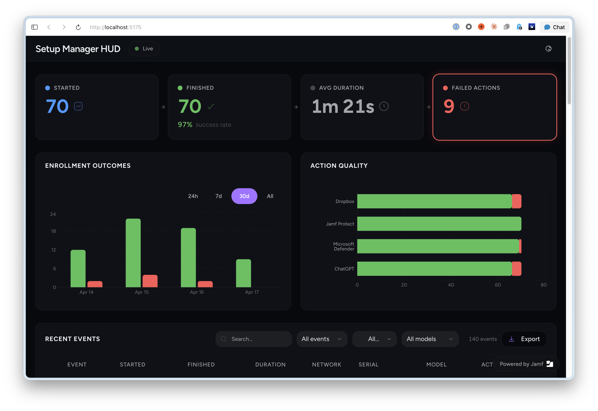
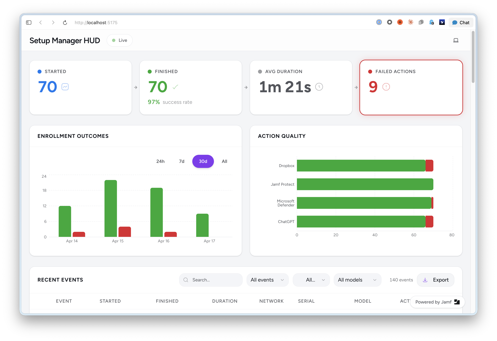

# Setup Manager HUD

A real-time webhook dashboard for [Setup Manager](https://github.com/nicknameislink/setupmanager) - monitor macOS device enrollments as they happen.

Built with React, shadcn/ui, and Cloudflare Workers. Deploys in minutes. Webhooks are protected with a required secret token; the dashboard can optionally be protected with Cloudflare Access.

| Dark Mode | Light Mode |
|-----------|------------|
|  |  |

## What It Does

Setup Manager sends webhook events during macOS device provisioning. This dashboard:

- **Shows enrollments in real-time** via WebSocket - no refresh needed
- **Tracks KPIs** - total enrollments, completion rate, average duration, failed actions
- **Displays event details** - device info, macOS version, enrollment actions, timing
- **Charts trends** - events over time, actions breakdown
- **Filters and searches** - by event type, model, macOS version, text search
- **Works in light and dark mode**
- **Can be secured by Cloudflare Access** - only authorized users can view the dashboard; the webhook endpoint stays open for devices

## Quick Start

**You do not have to fork this repo!** You can deploy it directly to your Cloudflare account.

### Option 1: Deploy Button (Fastest)

[](https://deploy.workers.cloudflare.com/?url=https://github.com/motionbug/setupmanagerhud)

Click the deploy button above. It will:
1. Fork this repo to your GitHub account
2. Provision the Worker resources declared in `wrangler.toml`, including the D1 database binding named `DB`
3. Set up a GitHub Actions workflow
4. Build, apply D1 migrations, and deploy to your Cloudflare account

> **Tip:** During setup, you'll be asked for a project name. This becomes your Worker URL (`<project-name>.<your-subdomain>.workers.dev`). You can name it anything you like — `setupmanagerhud`, `enrollment-dashboard`, or even something obscure like `x7k9-internal`. A less obvious name makes the URL harder to guess, which is fine as long as it's a valid URL (lowercase letters, numbers, and hyphens).

After clicking Deploy, you'll need to:
- Set a `WEBHOOK_TOKEN` secret on your Worker (see [Webhook Token](#webhook-token-required))
- Check that the D1 database was provisioned and bound as `DB` (see [D1 Database](#d1-database-required))
- Optionally [secure the dashboard](#security-setup) with Cloudflare Access

### Option 2: Manual Deploy

**Prerequisites:**
- [Node.js](https://nodejs.org/) 20 or later
- A [Cloudflare account](https://dash.cloudflare.com/sign-up) (free tier works)
- [Wrangler CLI](https://developers.cloudflare.com/workers/wrangler/install-and-update/) (`npm install -g wrangler`)

```bash
# 1. Clone the repo
git clone https://github.com/motionbug/setupmanagerhud.git
cd setupmanagerhud

# 2. Install dependencies
npm install

# 3. Log in to Cloudflare
npx wrangler login

# 4. Create the D1 database for event storage
npx wrangler d1 create setupmanagerhud-events
# -> Copy the database_id from the output

# 5. Paste the D1 database ID into wrangler.toml:
#    database_id = "your-d1-database-id-here"

# 6. Apply the D1 migrations
npx wrangler d1 migrations apply DB --remote

# 7. Set the webhook token secret
npx wrangler secret put WEBHOOK_TOKEN

# 8. Deploy
npm run deploy
```

Your dashboard is now live at `https://setupmanagerhud.<your-subdomain>.workers.dev`

**Next step:** Configure Setup Manager to send your `WEBHOOK_TOKEN`. You can also [secure the dashboard](#security-setup) with Cloudflare Access so only authorized users can view it.

### Option 3: GitHub Actions

> **Note:** If you used the Deploy Button (Option 1), this is already set up for you. This section is for manual forks or if you need to reconfigure the workflow.

This repo includes a GitHub Actions workflow that builds, applies D1 migrations, and deploys to Cloudflare Workers. It runs manually from the Actions tab — useful if you prefer deploying from GitHub instead of the command line.

GitHub Actions needs permission to deploy to your Cloudflare account. This is done through two repository secrets:

1. Fork this repo
2. **Create a Cloudflare API token** — this is what allows GitHub to deploy on your behalf:
   - Go to [Cloudflare API Tokens](https://dash.cloudflare.com/profile/api-tokens)
   - Click **Create Token**
   - Use the **Edit Cloudflare Workers** template
   - Save the generated token
3. **Find your Cloudflare Account ID:**
   - Go to the [Cloudflare dashboard](https://dash.cloudflare.com)
   - Your Account ID is shown in the right sidebar on the overview page
4. **Add both as repository secrets** in your fork:
   - Go to **Settings → Secrets and variables → Actions**
   - Add `CLOUDFLARE_API_TOKEN` with the token from step 2
   - Add `CLOUDFLARE_ACCOUNT_ID` with the ID from step 3
5. Create your D1 database and add its ID to `wrangler.toml` (see [D1 Database](#d1-database-required) for CLI steps)
6. Set `WEBHOOK_TOKEN` as a Worker secret with Wrangler or in the Cloudflare dashboard
7. Go to the **Actions** tab in your fork, select **Deploy to Cloudflare Workers**, and click **Run workflow**

## Security Setup

Setup Manager HUD has two separate security layers: a required webhook token for device POSTs, and optional Cloudflare Access protection for the dashboard.

> [!TIP]
> **Full security setup guide:** [Security](https://github.com/motionbug/setupmanagerhud/wiki/Security) covers webhook token configuration, Cloudflare Access setup, and rate limiting.

- **Webhook token** is required for `/webhook` — [configuration guide](https://github.com/motionbug/setupmanagerhud/wiki/Security#webhook-token-setup-required-for-production)
- **Cloudflare Access** is optional dashboard authentication — [setup guide](https://github.com/motionbug/setupmanagerhud/wiki/Security#cloudflare-access-optional-dashboard-authentication)
- **Rate limiting** prevents abuse — [WAF rules guide](https://github.com/motionbug/setupmanagerhud/wiki/Security#rate-limiting-the-webhook-endpoint)

### Cloudflare Access JWT Validation

Cloudflare Access is optional dashboard authentication. If you enable it, you can also have the Worker verify Cloudflare Access JWTs before serving dashboard, API, and WebSocket requests. This hardening step is separate from the required `WEBHOOK_TOKEN`; `/webhook` must bypass Access so Setup Manager devices can post events. When JWT validation is enabled, rejected dashboard/API requests return `403` from the Worker and still include the standard security headers.

To enable Worker-side JWT validation, create your Access application, find its audience tag and team domain, then add these values to `wrangler.toml`:

```toml
[vars]
CF_ACCESS_AUD = "paste-your-audience-tag-here"
CF_ACCESS_TEAM_DOMAIN = "your-team.cloudflareaccess.com"
```

If you used the Deploy Button, Cloudflare created a copy of this repository in your GitHub account and deployed from that copy. Update `wrangler.toml` in that copied repo, then redeploy in one of two ways:

- Clone your copied repo locally, run `npm install`, edit `wrangler.toml`, then run `npx wrangler login` and `npm run deploy`.
- Edit `wrangler.toml` in GitHub, make sure Actions are enabled and `CLOUDFLARE_API_TOKEN` / `CLOUDFLARE_ACCOUNT_ID` secrets exist, then run the deploy workflow.

See the wiki’s [JWT validation section](https://github.com/motionbug/setupmanagerhud/wiki/Security#optional-verify-cloudflare-access-jwts-in-the-worker) for the full walkthrough.

## Configuration

### Webhook Token (Required)

Setup Manager HUD requires a shared token for `POST /webhook`. Generate a long random value, set it as the Worker secret `WEBHOOK_TOKEN`, and configure Setup Manager to send the same value.

With Wrangler:

```bash
npx wrangler secret put WEBHOOK_TOKEN
```

Or in the Cloudflare dashboard, open your Worker, go to **Settings → Variables and Secrets**, add a secret named `WEBHOOK_TOKEN`, and redeploy if prompted.

Setup Manager sends this value in the `Authorization` header without the `Bearer` prefix. The Worker accepts both raw tokens and standard `Bearer` tokens so curl and other tools are easy to use.

### D1 Database (Required)

Setup Manager HUD stores webhook events in [Cloudflare D1](https://developers.cloudflare.com/d1/). You need to create a database, apply the included migrations, and connect it to your Worker. Without this, webhook and API responses return a 503 configuration error and the dashboard shows a storage warning.

For Deploy Button users, Cloudflare can provision the D1 database because the `DB` binding is declared in `wrangler.toml`. The deploy script applies migrations with the binding name (`DB`) before deploying the Worker. After deploy, confirm that the Worker has a D1 binding named `DB`.

For CLI or GitHub Actions deployments, create a database, add its ID to `wrangler.toml`, and apply migrations:

```bash
npx wrangler d1 create setupmanagerhud-events
npx wrangler d1 migrations apply DB --remote
```

```toml
[[d1_databases]]
binding = "DB"
database_name = "setupmanagerhud-events"
database_id = "paste-your-d1-database-id-here"
```

See the wiki’s [Configuration guide](https://github.com/motionbug/setupmanagerhud/wiki/Configuration) for dashboard steps, CLI steps, and how redeploys affect bindings.

By default, a daily scheduled cleanup keeps 90 days of D1 event history. You can change this by setting `RETENTION_DAYS` in `wrangler.toml`.

### Connecting Setup Manager

In your Setup Manager configuration, set the webhook URL to:

```
<key>webhooks</key>
<dict>
  <key>started</key>
  <string>https://setupmanagerhud.<your-subdomain>.workers.dev/webhook</string>
  <key>finished</key>
  <string>https://setupmanagerhud.<your-subdomain>.workers.dev/webhook</string>
</dict>
```

If either the `started` or `finished` key is missing, no webhook will be sent for that event.

Setup Manager will POST enrollment events to this endpoint. They'll appear on the dashboard in real-time.

> [!NOTE]
> Webhook requests require `WEBHOOK_TOKEN`. See [Webhook Token Setup](https://github.com/motionbug/setupmanagerhud/wiki/Security#webhook-token-setup-required-for-production) in the wiki.

### Test with a Sample Webhook

You can test without Setup Manager by sending a sample webhook:

```bash
curl -X POST https://setupmanagerhud.<your-subdomain>.workers.dev/webhook \
  -H "Content-Type: application/json" \
  -H "Authorization: your-webhook-token" \
  -d '{
    "name": "Started",
    "event": "com.jamf.setupmanager.started",
    "timestamp": "'$(date -u +%Y-%m-%dT%H:%M:%SZ)'",
    "started": "'$(date -u +%Y-%m-%dT%H:%M:%SZ)'",
    "modelName": "MacBook Pro",
    "modelIdentifier": "Mac15,3",
    "macOSBuild": "24A335",
    "macOSVersion": "15.0",
    "serialNumber": "TESTSERIAL01",
    "setupManagerVersion": "2.0.0"
  }'
```

> [!TIP]
> **Advanced configuration:** See the [Configuration](https://github.com/motionbug/setupmanagerhud/wiki/Configuration) wiki page for environment variables, wrangler.toml reference, and health check endpoints.

## Local Development

```bash
# Start the Vite dev server (frontend only, hot reload)
npm run dev

# Start the full Worker locally (with D1, Durable Objects, WebSocket)
npm run dev:worker
```

For local Worker development, create a `.dev.vars` file (see `.dev.vars.example`).

> **Note:** Cloudflare Access is not active during local development. The dashboard is unprotected when running locally, but `/webhook` still requires `WEBHOOK_TOKEN`.

## Testing the Dashboard

After deploying, you can populate the dashboard with dummy data to verify everything is working.

### Send Dummy Events

The included test script generates 140 realistic webhook events (70 started + 70 finished) across 10 simulated devices, spread over the past 3 days. This gives the dashboard enough data to display KPIs, charts, and event details.

```bash
# Replace with your actual Worker URL
WORKER_URL=https://setupmanagerhud.<your-subdomain>.workers.dev \
  WEBHOOK_TOKEN=your-token-here \
  node scripts/send-dummy-events.js
```

The script sends the token as `Authorization: Bearer <token>`. Setup Manager sends the same token as a raw `Authorization` header; both formats are accepted.

Once the script finishes, open the dashboard in your browser. You should see events appearing with device details, enrollment actions, and charts populated with data.

### Cleaning Up Test Data from D1

Dummy events use serial numbers starting with `DUMMY`. You can remove them from D1 by running a filtered SQL delete against your database.

```bash
npx wrangler d1 execute setupmanagerhud-events \
  --remote \
  --command "DELETE FROM events WHERE serial_number LIKE 'DUMMY%'"
```

### API Event Filters

`GET /api/events` returns an array of stored events. The endpoint supports server-side filtering so large deployments do not need to pull every recent event into the browser before narrowing results.

Supported query parameters:

| Parameter | Values |
|-----------|--------|
| `limit` | `1` to `1000` |
| `offset` | `0` or higher |
| `eventType` | `started`, `finished`, `failed` |
| `failedOnly` | `true` |
| `macOSVersion` | partial version text |
| `model` | partial model name |
| `serial` | partial serial number |
| `search` | searches serial, model, computer name, macOS version, and user ID |
| `timeRange` | `hour`, `day`, `week` |

Example:

```bash
curl "https://setupmanagerhud.<your-subdomain>.workers.dev/api/events?eventType=failed&timeRange=week&limit=50"
```

## Architecture

```
                    ┌─── Cloudflare Access ───┐
                    │ (optional dashboard auth) │
                    └──────────┬───────────────┘
                               │
                    Authenticated dashboard requests
                               │
                               ▼
┌─────────────────────────────────────────────────┐
│              Cloudflare Worker                 │
│                                                │
│  POST /webhook ──→ Validate ──→ Store in D1    │
│  (bypasses Access)       └──→ Broadcast via DO │
│                                                │
│  GET /ws ──→ Durable Object (WebSocket hub)    │
│                  ├── Send history on connect   │
│                  └── Broadcast new events live │
│                                                │
│  GET /api/events ──→ Read from D1              │
│  GET /api/stats  ──→ Aggregate from D1         │
│  GET /api/health ──→ Check D1 + DO status      │
│  Scheduled cron ──→ Delete old D1 events       │
│                                                │
│  GET /* ──→ Serve React dashboard (static)     │
└─────────────────────────────────────────────────┘
```

- **Cloudflare Access** - Optional authentication gate at the edge. Protects the dashboard when enabled; `/webhook` stays reachable and is protected by `WEBHOOK_TOKEN`.
- **Cloudflare Workers** - Serverless edge runtime, handles all HTTP and WebSocket traffic
- **Durable Objects** - WebSocket hub with hibernation for real-time event broadcasting
- **Cloudflare D1** - SQL event storage for webhook history, stats, and server-side filtering
- **Scheduled Worker** - Daily retention cleanup for old D1 events, defaulting to 90 days
- **React + shadcn/ui** - Dashboard UI, built with Vite, served as static assets

## Troubleshooting

| Problem | Likely Cause | Solution |
|---------|--------------|----------|
| Worker returns 503 configuration error | D1 database not bound or migrations not applied | See [D1 setup](https://github.com/motionbug/setupmanagerhud/wiki/Configuration) |
| Dashboard shows storage warning | D1 or Durable Object health check is degraded | Check `/api/health`, D1 binding `DB`, and migrations |
| Dashboard shows no events | WebSocket not connecting | Check browser console for errors |
| Webhook returns 401 | Token mismatch | Verify `WEBHOOK_TOKEN` matches your Setup Manager config |
| Can't access dashboard after enabling Access | Cloudflare Access misconfigured | Check `CF_ACCESS_AUD` and `CF_ACCESS_TEAM_DOMAIN` |

For detailed fixes, see the [Troubleshooting wiki](https://github.com/motionbug/setupmanagerhud/wiki/Troubleshooting). For token behavior, see [Webhook Authentication Format](https://github.com/motionbug/setupmanagerhud/wiki/Troubleshooting#webhooks-return-401-unauthorized).

## Contributing

Contributions welcome! Please open an issue first to discuss what you'd like to change.

## License

[MIT](LICENSE)
